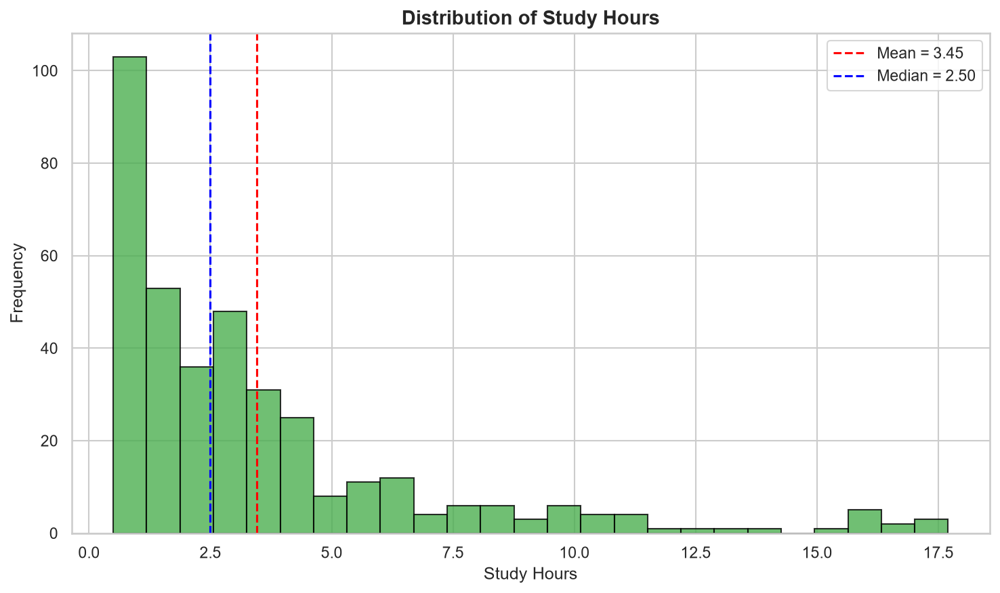
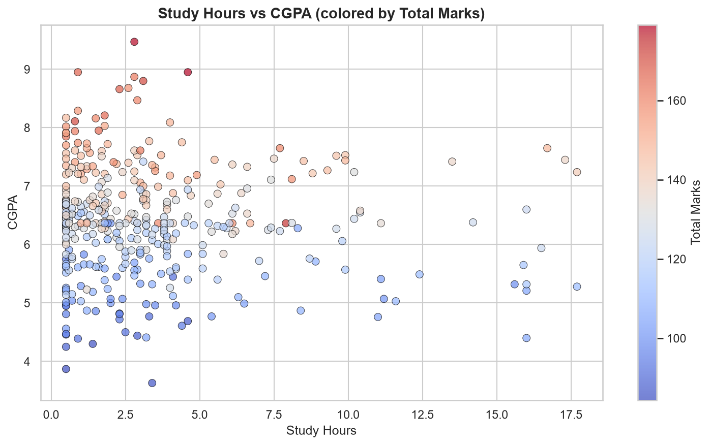
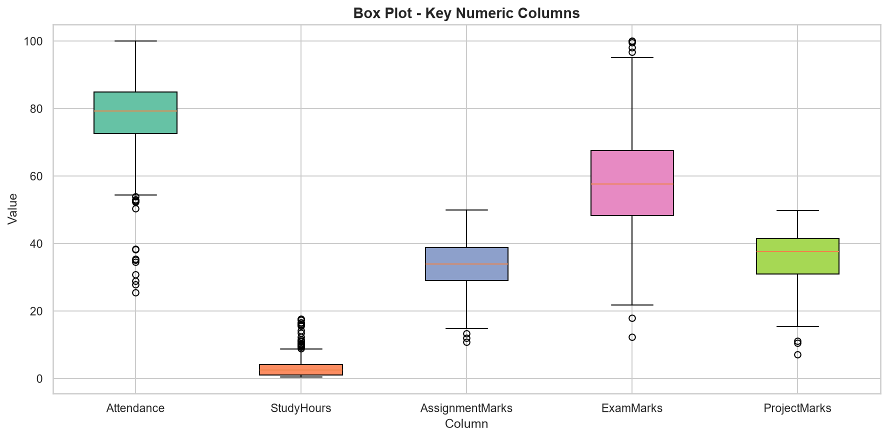
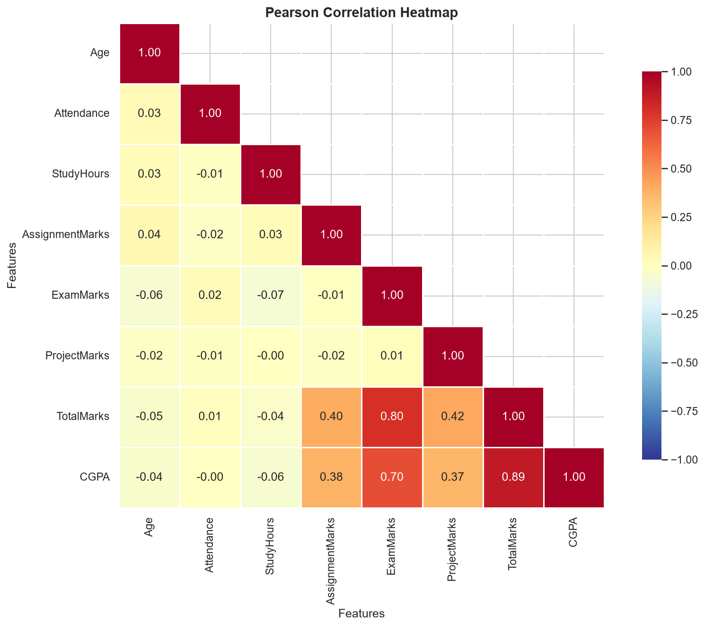

# Part 1 - Data Acquisition, Cleaning, and Exploratory Analysis

A comprehensive Python-based Exploratory Data Analysis (EDA) project that demonstrates the complete data science workflow — from data acquisition and cleaning to statistical analysis and visualization — using a realistic synthetic student performance dataset.

---

## Table of Contents

1. [Project Overview](#project-overview)
2. [Folder Structure](#folder-structure)
3. [Dataset Description](#dataset-description)
4. [Missing Value Analysis](#missing-value-analysis)
5. [Duplicate Analysis](#duplicate-analysis)
6. [Data Type Conversion](#data-type-conversion)
7. [Memory Comparison](#memory-comparison)
8. [Skewness Interpretation](#skewness-interpretation)
9. [IQR Outlier Interpretation](#iqr-outlier-interpretation)
10. [Histogram Interpretation](#histogram-interpretation)
11. [Scatter Plot Interpretation](#scatter-plot-interpretation)
12. [Box Plot Interpretation](#box-plot-interpretation)
13. [Heatmap Interpretation](#heatmap-interpretation)
14. [Pearson vs Spearman Interpretation](#pearson-vs-spearman-interpretation)
15. [GroupBy Interpretation](#groupby-interpretation)
16. [Conclusion](#conclusion)

---

## Project Overview

This project is designed as **Part 1** of a college Data Analysis assignment. It covers the foundational stages of any data science pipeline:

- **Data Acquisition**: A realistic synthetic dataset of 500 student records is generated with deliberate imperfections (missing values, duplicates, incorrect data types, outliers, and skewed distributions) to simulate real-world data.
- **Data Cleaning**: Missing values are imputed using median strategies, duplicates are detected and removed, and data types are corrected.
- **Exploratory Analysis**: Descriptive statistics, skewness analysis, outlier detection (IQR method), correlation analysis (Pearson & Spearman), and GroupBy aggregations are performed.
- **Visualization**: Six professional-quality visualizations are created (Line Plot, Bar Chart, Histogram, Scatter Plot, Box Plot, and Correlation Heatmap).

### How to Run

```bash
# 1. Install dependencies
pip install -r requirements.txt

# 2. Generate the synthetic dataset
python generate_dataset.py

# 3. Run the Python script
python part1_eda.py

# 4. OR open the Jupyter Notebook
jupyter notebook Part1_EDA.ipynb
```

---

## Folder Structure

```
EDA_Assignment/
|
|-- dataset/
|   |-- student_data.csv        # Original synthetic dataset (508 rows with duplicates)
|   |-- cleaned_data.csv        # Cleaned dataset (500 rows, no missing/duplicates)
|
|-- images/
|   |-- line_plot.png           # Average Total Marks by Department
|   |-- bar_chart.png           # Student count per Department
|   |-- histogram.png           # Distribution of Study Hours
|   |-- scatter_plot.png        # Study Hours vs CGPA
|   |-- box_plot.png            # Box Plot of key numeric columns
|   |-- heatmap.png             # Pearson Correlation Heatmap
|
|-- Part1_EDA.ipynb             # Jupyter Notebook (interactive version)
|-- part1_eda.py                # Python script (non-interactive version)
|-- generate_dataset.py         # Dataset generation script
|-- README.md                   # This file
|-- requirements.txt            # Python dependencies
|-- .gitignore                  # Git ignore rules
```

---

## Dataset Description

The dataset (`dataset/student_data.csv`) contains **508 rows** (500 unique + 8 duplicates) and **14 columns** representing student academic records:

| Column          | Type        | Description                           |
|-----------------|-------------|---------------------------------------|
| StudentID       | String      | Unique student identifier (S001-S500) |
| Name            | String      | Student's full name                   |
| Gender          | Categorical | Male / Female                         |
| Department      | Categorical | Academic department (6 departments)   |
| Age             | Numeric     | Student age (18-32, right-skewed)     |
| Attendance      | Numeric     | Attendance percentage (25-100%)       |
| StudyHours      | Numeric     | Daily study hours (right-skewed)      |
| AssignmentMarks | Numeric     | Assignment score (0-50)               |
| ExamMarks       | String*     | Exam score (0-100) *stored as text*   |
| ProjectMarks    | Numeric     | Project score (0-50)                  |
| TotalMarks      | Numeric     | Sum of Assignment + Exam + Project    |
| CGPA            | Numeric     | Cumulative GPA (3.0-10.0)            |
| Result          | Categorical | Pass / Fail                           |
| PlacementStatus | Categorical | Placed / Not Placed                   |

**Key characteristics:**
- Mix of numeric and categorical columns
- `ExamMarks` is intentionally stored as a string (requires type conversion)
- Missing values inserted across 6 columns
- 8 duplicate rows included
- `StudyHours` has a strong right skew (skewness = 2.03)
- Outliers present in `StudyHours`, `Attendance`, and `Age`

---

## Missing Value Analysis

The dataset has missing values distributed across six columns:

| Column          | Missing Count | Missing Percentage |
|-----------------|---------------|-------------------|
| StudyHours      | 128           | **25.20%**        |
| Attendance      | 61            | 12.01%            |
| AssignmentMarks | 42            | 8.27%             |
| CGPA            | 30            | 5.91%             |
| ProjectMarks    | 20            | 3.94%             |
| Age             | 16            | 3.15%             |

**Column with >20% missing**: `StudyHours` (25.20%)

**Imputation Strategy**:
- Numeric columns with **<= 20% missing** (Age, Attendance, AssignmentMarks, ProjectMarks, CGPA) were filled using the **median** — a robust measure unaffected by outliers.
- `StudyHours` (>20% missing) was imputed separately in Step 14 after skewness analysis to ensure the median is the appropriate measure.

**Why Median?** The median is preferred over the mean for imputation when data is skewed or contains outliers, as it provides a more representative central value that won't distort the distribution.

---

## Duplicate Analysis

- **Duplicates detected**: 8 rows
- **Duplicates removed**: 8 rows
- **Shape after removal**: 500 rows x 14 columns

Duplicates were identified using `df.duplicated().sum()` and removed with `df.drop_duplicates()`. These duplicates shared identical values across all columns, indicating they were true duplicates rather than coincidentally similar records.

---

## Data Type Conversion

Two types of conversions were performed:

1. **`ExamMarks` (String -> Numeric)**: This column was stored as text (e.g., `"66.6"`, `"72.7 marks"`). Using `pd.to_numeric(errors='coerce')`, valid numbers were converted and invalid entries (like `"72.7 marks"`) became NaN, which were then filled with the column median (57.6).

2. **Categorical Columns**: Four columns (`Gender`, `Department`, `Result`, `PlacementStatus`) were converted from generic `object`/`str` type to pandas `category` dtype for memory efficiency and semantic correctness.

---

## Memory Comparison

| Metric           | Value         |
|------------------|---------------|
| Memory BEFORE    | ~225 KB       |
| Memory AFTER     | ~92 KB        |
| Memory Saved     | ~133 KB       |
| Reduction        | **~59%**      |

Converting string columns to `category` type dramatically reduced memory usage. This is because categorical columns store each unique value only once internally and use integer codes for references, rather than storing the full string for every row.

---

## Skewness Interpretation

| Column          | Skewness |
|-----------------|----------|
| StudyHours      | **2.03** |
| Age             | **1.39** |
| Attendance      | -1.23    |
| ProjectMarks    | -0.75    |
| ExamMarks       | 0.16     |
| AssignmentMarks | -0.14    |
| TotalMarks      | -0.07    |
| CGPA            | -0.01    |

**Interpretation:**
- **StudyHours (skewness = 2.03)**: Highly right-skewed. Most students study a moderate number of hours, but a few study significantly more. The distribution has a long right tail.
- **Age (skewness = 1.39)**: Moderately right-skewed. Most students are 18-22, with a few older students pulling the tail rightward.
- **Attendance (skewness = -1.23)**: Left-skewed. Most students have high attendance, but a few have very low attendance pulling the tail leftward.

**Rule of thumb:**
- |skewness| < 0.5 = approximately symmetric
- 0.5 < |skewness| < 1.0 = moderately skewed
- |skewness| > 1.0 = highly skewed

---

## IQR Outlier Interpretation

### StudyHours
| Metric       | Value   |
|-------------|---------|
| Q1          | 1.00    |
| Q3          | 4.15    |
| IQR         | 3.15    |
| Lower Bound | -3.73   |
| Upper Bound | 8.88    |
| Outliers    | **31**  |

StudyHours has 31 outliers (values above 8.88 hours). These represent students who study significantly more than their peers. This aligns with the right-skewed distribution — the long tail contains these extreme studiers.

### Attendance
| Metric       | Value   |
|-------------|---------|
| Q1          | 72.70   |
| Q3          | 85.00   |
| IQR         | 12.30   |
| Lower Bound | 54.25   |
| Upper Bound | 103.45  |
| Outliers    | **16**  |

Attendance has 16 outliers, primarily students with very low attendance (below 54.25%). The upper bound exceeds 100%, so all upper outliers are capped by the natural maximum.

**Note**: Outliers were retained in the dataset for analysis, as they represent genuine (though extreme) student behaviors.

---

## Histogram Interpretation



The histogram of `StudyHours` reveals a **strongly right-skewed distribution**:
- The majority of students study between 0.5 and 5 hours per day
- A significant gap exists between the **mean (3.45)** and **median (2.50)**, confirming the skewness
- The long right tail shows a small number of students studying 10-18 hours
- The mean is pulled rightward by the extreme values, making the median a more representative measure of central tendency

This pattern is realistic — most students study a moderate amount, while a few highly dedicated students study much more.

---

## Scatter Plot Interpretation



The scatter plot of `StudyHours` vs `CGPA` (colored by `TotalMarks`) reveals:
- **No strong linear relationship** between study hours and CGPA — the points are widely dispersed
- The color gradient shows that higher Total Marks (red/warm colors) tend to correspond with higher CGPAs, as expected
- Some students with low study hours still achieve high CGPAs, suggesting that study efficiency, natural ability, or other factors play a role
- The scatter demonstrates that raw study hours alone are not a reliable predictor of academic performance

---

## Box Plot Interpretation



The box plot compares five key numeric columns:
- **Attendance**: Compact IQR (72-85%) with several low outliers — most students attend regularly, but a few have very poor attendance
- **StudyHours**: Compact IQR with many upper outliers — confirms the right skew; the whiskers extend far to the right
- **AssignmentMarks**: Fairly symmetric distribution centered around 34, minimal outliers
- **ExamMarks**: Wider spread (IQR spanning ~48-68), reflecting greater variability in exam performance
- **ProjectMarks**: Slightly left-skewed with the median above the midpoint of the IQR, indicating most students perform well on projects

---

## Heatmap Interpretation



Key correlations observed:
- **TotalMarks-CGPA (r = 0.89)**: Strongest correlation — CGPA is heavily derived from total marks
- **ExamMarks-TotalMarks (r = 0.80)**: Exam marks are the largest contributor to total marks
- **ExamMarks-CGPA (r = 0.70)**: Strong positive — exam performance strongly influences final GPA
- **AssignmentMarks-TotalMarks (r = 0.40)** and **ProjectMarks-TotalMarks (r = 0.42)**: Moderate positive correlations
- **StudyHours vs. academic metrics**: Surprisingly weak correlations (< 0.07), suggesting study hours alone don't predict performance
- **Attendance**: Nearly zero correlation with all academic metrics

---

## Pearson vs Spearman Interpretation

| Variable 1 | Variable 2    | Pearson | Spearman | Abs. Difference |
|-----------|---------------|---------|----------|-----------------|
| Age       | StudyHours    | 0.029   | -0.063   | **0.092**       |
| Age       | ProjectMarks  | -0.018  | 0.022    | 0.040           |
| StudyHours| ProjectMarks  | -0.003  | 0.032    | 0.035           |

**Interpretation:**
- **Pearson** measures *linear* relationships, while **Spearman** measures *monotonic* (rank-based) relationships.
- The largest difference is between **Age** and **StudyHours** (0.092). Pearson shows a slight positive linear correlation, but Spearman shows a negative monotonic trend. This reversal suggests the relationship is non-linear — perhaps middle-aged students study more while both younger and older students study less.
- Overall, the differences are small (all < 0.10), indicating that the relationships in this dataset are approximately linear. Large differences would suggest non-linear patterns that Pearson misses but Spearman captures.
- For strongly correlated pairs like **TotalMarks-CGPA** (Pearson=0.887, Spearman=0.868), the small difference (0.019) confirms a near-linear relationship.

---

## GroupBy Interpretation

### GroupBy Department - TotalMarks

| Department              | Mean   | Std    | Count |
|-------------------------|--------|--------|-------|
| Civil                   | 128.33 | 18.57  | 50    |
| Computer Science        | 126.95 | 18.09  | 122   |
| Electrical              | 124.52 | 17.88  | 72    |
| Electronics             | 127.53 | 16.42  | 91    |
| Information Technology  | 128.10 | 19.13  | 91    |
| Mechanical              | 130.13 | 18.63  | 74    |

**Key Findings:**
- **Highest Mean**: Mechanical (130.13) — students in this department score slightly higher on average
- **Lowest Mean**: Electrical (124.52)
- **Mean Ratio**: Mechanical / Electrical = **1.045** (only a 4.5% difference, suggesting relatively uniform performance across departments)
- **Highest Std**: Information Technology (19.13) — widest spread in scores, indicating the most variability in student performance
- **Lowest Std**: Electronics (16.42) — most consistent performance
- **Largest Department**: Computer Science (122 students) — over 24% of the student body

The relatively similar means across departments (range of ~5.6 marks) suggest that academic performance is not strongly department-dependent. However, the varying standard deviations indicate different levels of consistency within departments.

---

## Conclusion

This EDA project successfully demonstrated the complete data cleaning and exploratory analysis pipeline:

1. **Data Quality Issues Identified**: The dataset contained 6 columns with missing values (up to 25.2%), 8 duplicate rows, incorrect data types, and significant outliers — all common in real-world datasets.

2. **Effective Cleaning**: Median imputation preserved distribution shapes for skewed data, duplicate removal restored the intended dataset size, and type conversions achieved a ~59% memory reduction.

3. **Key Statistical Insights**:
   - `StudyHours` is the most skewed column (2.03), requiring special handling
   - 31 outliers in `StudyHours` and 16 in `Attendance` were identified but retained
   - `TotalMarks` and `CGPA` are the most strongly correlated pair (r = 0.89)
   - Study hours show surprisingly weak correlation with academic performance

4. **Department Analysis**: Academic performance is relatively uniform across departments, with only a 4.5% difference between the highest and lowest mean TotalMarks.

5. **Correlation Methods**: Pearson and Spearman correlations largely agree (differences < 0.10), confirming approximately linear relationships in the dataset.

---

## Requirements

- Python 3.8+
- pandas >= 2.0.0
- numpy >= 1.24.0
- matplotlib >= 3.7.0
- seaborn >= 0.12.0
- jupyter >= 1.0.0

Install with:
```bash
pip install -r requirements.txt
```

---

*Project created for academic purposes - Part 1: Data Acquisition, Cleaning, and Exploratory Analysis*
