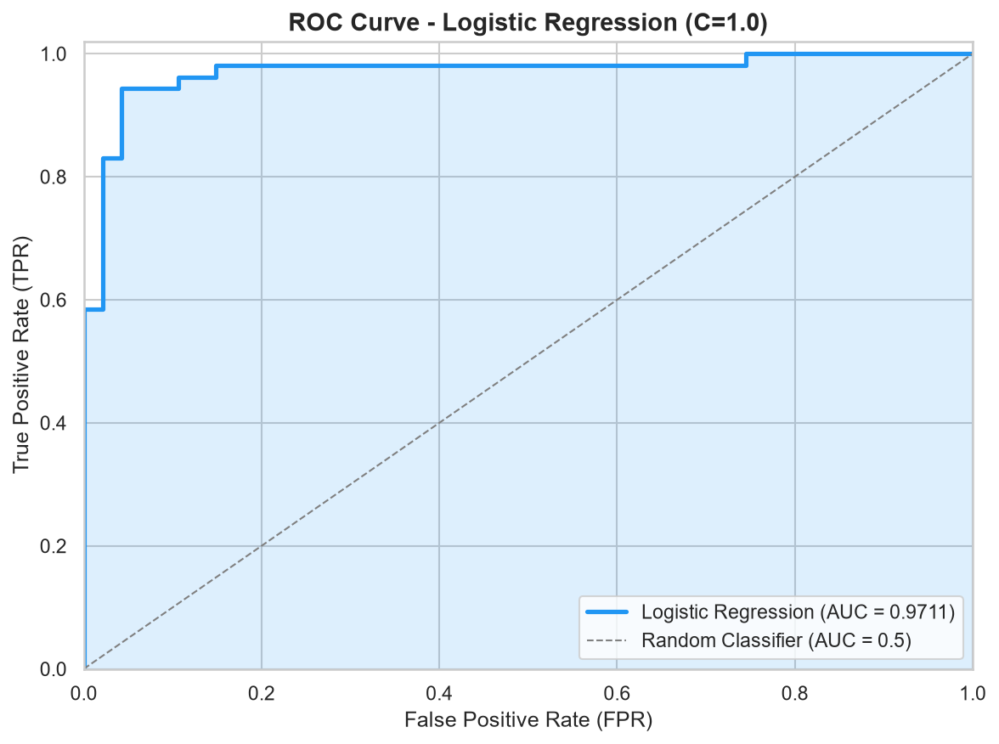

# EDA Assignment - Data Analysis and Machine Learning

A comprehensive Python-based data science project covering **Part 1 (EDA)** and **Part 2 (Machine Learning)**. The project demonstrates the complete workflow — from data acquisition and cleaning to statistical analysis, visualization, regression, classification, and model evaluation — using a realistic synthetic student performance dataset.

---

## Table of Contents

### Part 1 - EDA
1. [Project Overview](#project-overview)
2. [Folder Structure](#folder-structure)
3. [Dataset Description](#dataset-description)
4. [Missing Value Analysis](#missing-value-analysis)
5. [Duplicate Analysis](#duplicate-analysis)
6. [Data Type Conversion](#data-type-conversion)
7. [Memory Comparison](#memory-comparison)
8. [Skewness Interpretation](#skewness-interpretation)
9. [IQR Outlier Interpretation](#iqr-outlier-interpretation)
10. [Histogram Interpretation](#histogram-interpretation)
11. [Scatter Plot Interpretation](#scatter-plot-interpretation)
12. [Box Plot Interpretation](#box-plot-interpretation)
13. [Heatmap Interpretation](#heatmap-interpretation)
14. [Pearson vs Spearman Interpretation](#pearson-vs-spearman-interpretation)
15. [GroupBy Interpretation](#groupby-interpretation)
16. [Part 1 Conclusion](#part-1-conclusion)

### Part 2 - Machine Learning
17. [Target Definitions](#target-definitions)
18. [Encoding Decisions](#encoding-decisions)
19. [Train/Test Split Explanation](#traintest-split-explanation)
20. [Scaling Explanation & Data Leakage](#scaling-explanation--data-leakage)
21. [Linear Regression Interpretation](#linear-regression-interpretation)
22. [Coefficient Interpretation](#coefficient-interpretation)
23. [Ridge Regression Explanation](#ridge-regression-explanation)
24. [Logistic Regression Explanation](#logistic-regression-explanation)
25. [Confusion Matrix Interpretation](#confusion-matrix-interpretation)
26. [Precision & Recall Formulas](#precision--recall-formulas)
27. [ROC & AUC Explanation](#roc--auc-explanation)
28. [Threshold Comparison Explanation](#threshold-comparison-explanation)
29. [Regularization Explanation (C Parameter)](#regularization-explanation-c-parameter)
30. [Bootstrap & Confidence Interval Interpretation](#bootstrap--confidence-interval-interpretation)
31. [Part 2 Conclusion](#part-2-conclusion)

---

## Project Overview

This project is designed as a two-part college Data Analysis assignment.

**Part 1** covers the foundational stages of any data science pipeline:

- **Data Acquisition**: A realistic synthetic dataset of 500 student records is generated with deliberate imperfections (missing values, duplicates, incorrect data types, outliers, and skewed distributions) to simulate real-world data.
- **Data Cleaning**: Missing values are imputed using median strategies, duplicates are detected and removed, and data types are corrected.
- **Exploratory Analysis**: Descriptive statistics, skewness analysis, outlier detection (IQR method), correlation analysis (Pearson & Spearman), and GroupBy aggregations are performed.
- **Visualization**: Six professional-quality visualizations are created (Line Plot, Bar Chart, Histogram, Scatter Plot, Box Plot, and Correlation Heatmap).

**Part 2** builds on the cleaned dataset and implements machine learning:

- **Regression**: Linear Regression and Ridge Regression to predict TotalMarks
- **Classification**: Logistic Regression to classify students as above/below median performance
- **Model Evaluation**: Confusion matrix, ROC/AUC, threshold sensitivity analysis
- **Statistical Testing**: Bootstrap confidence intervals for model comparison

### How to Run

```bash
# 1. Install dependencies
pip install -r requirements.txt

# 2. Generate the synthetic dataset
python generate_dataset.py

# 3. Run Part 1 (EDA)
python part1_eda.py

# 4. Run Part 2 (ML)
python part2_ml.py

# 5. OR open the Jupyter Notebooks
jupyter notebook Part1_EDA.ipynb
jupyter notebook Part2_ML.ipynb
```

---

## Folder Structure

```
EDA_Assignment/
|
|-- dataset/
|   |-- student_data.csv        # Original synthetic dataset (508 rows with duplicates)
|   |-- cleaned_data.csv        # Cleaned dataset (500 rows, no missing/duplicates)
|
|-- images/
|   |-- line_plot.png           # Average Total Marks by Department
|   |-- bar_chart.png           # Student count per Department
|   |-- histogram.png           # Distribution of Study Hours
|   |-- scatter_plot.png        # Study Hours vs CGPA
|   |-- box_plot.png            # Box Plot of key numeric columns
|   |-- heatmap.png             # Pearson Correlation Heatmap
|   |-- roc_curve.png           # ROC Curve for Logistic Regression
|
|-- Part1_EDA.ipynb             # Part 1 Jupyter Notebook
|-- Part2_ML.ipynb              # Part 2 Jupyter Notebook
|-- part1_eda.py                # Part 1 Python script
|-- part2_ml.py                 # Part 2 Python script
|-- generate_dataset.py         # Dataset generation script
|-- README.md                   # This file
|-- requirements.txt            # Python dependencies
|-- .gitignore                  # Git ignore rules
```

---

## Dataset Description

The dataset (`dataset/student_data.csv`) contains **508 rows** (500 unique + 8 duplicates) and **14 columns** representing student academic records:

| Column          | Type        | Description                           |
|-----------------|-------------|---------------------------------------|
| StudentID       | String      | Unique student identifier (S001-S500) |
| Name            | String      | Student's full name                   |
| Gender          | Categorical | Male / Female                         |
| Department      | Categorical | Academic department (6 departments)   |
| Age             | Numeric     | Student age (18-32, right-skewed)     |
| Attendance      | Numeric     | Attendance percentage (25-100%)       |
| StudyHours      | Numeric     | Daily study hours (right-skewed)      |
| AssignmentMarks | Numeric     | Assignment score (0-50)               |
| ExamMarks       | String*     | Exam score (0-100) *stored as text*   |
| ProjectMarks    | Numeric     | Project score (0-50)                  |
| TotalMarks      | Numeric     | Sum of Assignment + Exam + Project    |
| CGPA            | Numeric     | Cumulative GPA (3.0-10.0)            |
| Result          | Categorical | Pass / Fail                           |
| PlacementStatus | Categorical | Placed / Not Placed                   |

**Key characteristics:**
- Mix of numeric and categorical columns
- `ExamMarks` is intentionally stored as a string (requires type conversion)
- Missing values inserted across 6 columns
- 8 duplicate rows included
- `StudyHours` has a strong right skew (skewness = 2.03)
- Outliers present in `StudyHours`, `Attendance`, and `Age`

---

## Missing Value Analysis

The dataset has missing values distributed across six columns:

| Column          | Missing Count | Missing Percentage |
|-----------------|---------------|-------------------|
| StudyHours      | 128           | **25.20%**        |
| Attendance      | 61            | 12.01%            |
| AssignmentMarks | 42            | 8.27%             |
| CGPA            | 30            | 5.91%             |
| ProjectMarks    | 20            | 3.94%             |
| Age             | 16            | 3.15%             |

**Column with >20% missing**: `StudyHours` (25.20%)

**Imputation Strategy**:
- Numeric columns with **<= 20% missing** (Age, Attendance, AssignmentMarks, ProjectMarks, CGPA) were filled using the **median** — a robust measure unaffected by outliers.
- `StudyHours` (>20% missing) was imputed separately in Step 14 after skewness analysis to ensure the median is the appropriate measure.

**Why Median?** The median is preferred over the mean for imputation when data is skewed or contains outliers, as it provides a more representative central value that won't distort the distribution.

---

## Duplicate Analysis

- **Duplicates detected**: 8 rows
- **Duplicates removed**: 8 rows
- **Shape after removal**: 500 rows x 14 columns

Duplicates were identified using `df.duplicated().sum()` and removed with `df.drop_duplicates()`. These duplicates shared identical values across all columns, indicating they were true duplicates rather than coincidentally similar records.

---

## Data Type Conversion

Two types of conversions were performed:

1. **`ExamMarks` (String -> Numeric)**: This column was stored as text (e.g., `"66.6"`, `"72.7 marks"`). Using `pd.to_numeric(errors='coerce')`, valid numbers were converted and invalid entries (like `"72.7 marks"`) became NaN, which were then filled with the column median (57.6).

2. **Categorical Columns**: Four columns (`Gender`, `Department`, `Result`, `PlacementStatus`) were converted from generic `object`/`str` type to pandas `category` dtype for memory efficiency and semantic correctness.

---

## Memory Comparison

| Metric           | Value         |
|------------------|---------------|
| Memory BEFORE    | ~225 KB       |
| Memory AFTER     | ~92 KB        |
| Memory Saved     | ~133 KB       |
| Reduction        | **~59%**      |

Converting string columns to `category` type dramatically reduced memory usage. This is because categorical columns store each unique value only once internally and use integer codes for references, rather than storing the full string for every row.

---

## Skewness Interpretation

| Column          | Skewness |
|-----------------|----------|
| StudyHours      | **2.03** |
| Age             | **1.39** |
| Attendance      | -1.23    |
| ProjectMarks    | -0.75    |
| ExamMarks       | 0.16     |
| AssignmentMarks | -0.14    |
| TotalMarks      | -0.07    |
| CGPA            | -0.01    |

**Interpretation:**
- **StudyHours (skewness = 2.03)**: Highly right-skewed. Most students study a moderate number of hours, but a few study significantly more. The distribution has a long right tail.
- **Age (skewness = 1.39)**: Moderately right-skewed. Most students are 18-22, with a few older students pulling the tail rightward.
- **Attendance (skewness = -1.23)**: Left-skewed. Most students have high attendance, but a few have very low attendance pulling the tail leftward.

**Rule of thumb:**
- |skewness| < 0.5 = approximately symmetric
- 0.5 < |skewness| < 1.0 = moderately skewed
- |skewness| > 1.0 = highly skewed

---

## IQR Outlier Interpretation

### StudyHours
| Metric       | Value   |
|-------------|---------|
| Q1          | 1.00    |
| Q3          | 4.15    |
| IQR         | 3.15    |
| Lower Bound | -3.73   |
| Upper Bound | 8.88    |
| Outliers    | **31**  |

StudyHours has 31 outliers (values above 8.88 hours). These represent students who study significantly more than their peers. This aligns with the right-skewed distribution — the long tail contains these extreme studiers.

### Attendance
| Metric       | Value   |
|-------------|---------|
| Q1          | 72.70   |
| Q3          | 85.00   |
| IQR         | 12.30   |
| Lower Bound | 54.25   |
| Upper Bound | 103.45  |
| Outliers    | **16**  |

Attendance has 16 outliers, primarily students with very low attendance (below 54.25%). The upper bound exceeds 100%, so all upper outliers are capped by the natural maximum.

**Note**: Outliers were retained in the dataset for analysis, as they represent genuine (though extreme) student behaviors.

---

## Histogram Interpretation


The histogram of `StudyHours` reveals a **strongly right-skewed distribution**:
- The majority of students study between 0.5 and 5 hours per day
- A significant gap exists between the **mean (3.45)** and **median (2.50)**, confirming the skewness
- The long right tail shows a small number of students studying 10-18 hours
- The mean is pulled rightward by the extreme values, making the median a more representative measure of central tendency

This pattern is realistic — most students study a moderate amount, while a few highly dedicated students study much more.

---

## Scatter Plot Interpretation


The scatter plot of `StudyHours` vs `CGPA` (colored by `TotalMarks`) reveals:
- **No strong linear relationship** between study hours and CGPA — the points are widely dispersed
- The color gradient shows that higher Total Marks (red/warm colors) tend to correspond with higher CGPAs, as expected
- Some students with low study hours still achieve high CGPAs, suggesting that study efficiency, natural ability, or other factors play a role
- The scatter demonstrates that raw study hours alone are not a reliable predictor of academic performance

---

## Box Plot Interpretation


The box plot compares five key numeric columns:
- **Attendance**: Compact IQR (72-85%) with several low outliers — most students attend regularly, but a few have very poor attendance
- **StudyHours**: Compact IQR with many upper outliers — confirms the right skew; the whiskers extend far to the right
- **AssignmentMarks**: Fairly symmetric distribution centered around 34, minimal outliers
- **ExamMarks**: Wider spread (IQR spanning ~48-68), reflecting greater variability in exam performance
- **ProjectMarks**: Slightly left-skewed with the median above the midpoint of the IQR, indicating most students perform well on projects

---

## Heatmap Interpretation


Key correlations observed:
- **TotalMarks-CGPA (r = 0.89)**: Strongest correlation — CGPA is heavily derived from total marks
- **ExamMarks-TotalMarks (r = 0.80)**: Exam marks are the largest contributor to total marks
- **ExamMarks-CGPA (r = 0.70)**: Strong positive — exam performance strongly influences final GPA
- **AssignmentMarks-TotalMarks (r = 0.40)** and **ProjectMarks-TotalMarks (r = 0.42)**: Moderate positive correlations
- **StudyHours vs. academic metrics**: Surprisingly weak correlations (< 0.07), suggesting study hours alone don't predict performance
- **Attendance**: Nearly zero correlation with all academic metrics

---

## Pearson vs Spearman Interpretation

| Variable 1 | Variable 2    | Pearson | Spearman | Abs. Difference |
|-----------|---------------|---------|----------|-----------------|
| Age       | StudyHours    | 0.029   | -0.063   | **0.092**       |
| Age       | ProjectMarks  | -0.018  | 0.022    | 0.040           |
| StudyHours| ProjectMarks  | -0.003  | 0.032    | 0.035           |

**Interpretation:**
- **Pearson** measures *linear* relationships, while **Spearman** measures *monotonic* (rank-based) relationships.
- The largest difference is between **Age** and **StudyHours** (0.092). Pearson shows a slight positive linear correlation, but Spearman shows a negative monotonic trend. This reversal suggests the relationship is non-linear — perhaps middle-aged students study more while both younger and older students study less.
- Overall, the differences are small (all < 0.10), indicating that the relationships in this dataset are approximately linear. Large differences would suggest non-linear patterns that Pearson misses but Spearman captures.
- For strongly correlated pairs like **TotalMarks-CGPA** (Pearson=0.887, Spearman=0.868), the small difference (0.019) confirms a near-linear relationship.

---

## GroupBy Interpretation

### GroupBy Department - TotalMarks

| Department              | Mean   | Std    | Count |
|-------------------------|--------|--------|-------|
| Civil                   | 128.33 | 18.57  | 50    |
| Computer Science        | 126.95 | 18.09  | 122   |
| Electrical              | 124.52 | 17.88  | 72    |
| Electronics             | 127.53 | 16.42  | 91    |
| Information Technology  | 128.10 | 19.13  | 91    |
| Mechanical              | 130.13 | 18.63  | 74    |

**Key Findings:**
- **Highest Mean**: Mechanical (130.13) — students in this department score slightly higher on average
- **Lowest Mean**: Electrical (124.52)
- **Mean Ratio**: Mechanical / Electrical = **1.045** (only a 4.5% difference, suggesting relatively uniform performance across departments)
- **Highest Std**: Information Technology (19.13) — widest spread in scores, indicating the most variability in student performance
- **Lowest Std**: Electronics (16.42) — most consistent performance
- **Largest Department**: Computer Science (122 students) — over 24% of the student body

The relatively similar means across departments (range of ~5.6 marks) suggest that academic performance is not strongly department-dependent. However, the varying standard deviations indicate different levels of consistency within departments.

---

## Part 1 Conclusion

This EDA project successfully demonstrated the complete data cleaning and exploratory analysis pipeline:

1. **Data Quality Issues Identified**: The dataset contained 6 columns with missing values (up to 25.2%), 8 duplicate rows, incorrect data types, and significant outliers — all common in real-world datasets.

2. **Effective Cleaning**: Median imputation preserved distribution shapes for skewed data, duplicate removal restored the intended dataset size, and type conversions achieved a ~59% memory reduction.

3. **Key Statistical Insights**:
   - `StudyHours` is the most skewed column (2.03), requiring special handling
   - 31 outliers in `StudyHours` and 16 in `Attendance` were identified but retained
   - `TotalMarks` and `CGPA` are the most strongly correlated pair (r = 0.89)
   - Study hours show surprisingly weak correlation with academic performance

4. **Department Analysis**: Academic performance is relatively uniform across departments, with only a 4.5% difference between the highest and lowest mean TotalMarks.

5. **Correlation Methods**: Pearson and Spearman correlations largely agree (differences < 0.10), confirming approximately linear relationships in the dataset.

---
---

# Part 2 - Machine Learning: Regression and Classification

This section builds on the cleaned dataset from Part 1 and applies machine learning techniques for prediction and classification.

---

## Target Definitions

### Regression Target (`y_reg`)
- **Column**: `TotalMarks`
- **Type**: Continuous numeric
- **Goal**: Predict the total marks a student will score based on their features
- **Statistics**: Mean = 127.52, Std = 18.07, Range = [64.0, 179.1]

### Classification Target (`y_clf`)
- **Definition**: `y_clf = (TotalMarks > TotalMarks.median()).astype(int)`
- **Threshold**: TotalMarks > 127.4 (the median)
- **Class 0**: Below or equal to median (251 students)
- **Class 1**: Above median (249 students)
- **Balance**: Nearly balanced (50.2% vs 49.8%) — no severe imbalance

### Feature Selection
Columns **dropped** from the feature matrix:
- `StudentID`, `Name`: Identifiers, not predictive features
- `TotalMarks`: The target variable itself
- `CGPA`, `Result`: Derived from TotalMarks (would cause **data leakage**)
- `PlacementStatus`: A downstream outcome, not a predictor

**Final features used**: Gender, Department, Age, Attendance, StudyHours, AssignmentMarks, ExamMarks, ProjectMarks

---

## Encoding Decisions

| Column | Type | Encoding Method | Rationale |
|--------|------|-----------------|----------|
| Gender | Binary nominal | **Label Encoding** (Female=0, Male=1) | Only 2 categories; label encoding is equivalent to one-hot for binary features |
| Department | Multi-class nominal | **One-Hot Encoding** (`drop_first=True`) | No natural ordering; 6 categories create 5 dummy columns |

**Why `drop_first=True`?** Dropping one dummy column avoids **multicollinearity** (the dummy variable trap). With 6 departments, we create 5 columns — the dropped category becomes the baseline reference.

**Result**: 8 original features expanded to **12 encoded features**.

---

## Train/Test Split Explanation

```python
train_test_split(X, y, test_size=0.20, random_state=42)
```

| Split | Size | Purpose |
|-------|------|--------|
| Training set | 400 samples (80%) | Used to train the model — the model learns patterns from this data |
| Test set | 100 samples (20%) | Used to evaluate the model — simulates unseen, real-world data |

**Why 80/20?** This is a standard split that provides enough training data while retaining sufficient test data for reliable evaluation. With 500 samples, 100 test samples give reasonable confidence in metric estimates.

**`random_state=42`**: Ensures reproducibility — the same split occurs every time the code is run.

---

## Scaling Explanation & Data Leakage

### Why Scale?
StandardScaler transforms each feature to have **mean = 0** and **standard deviation = 1**. This is critical because:
- Linear models treat all features equally in their optimization — a feature with range [0, 100] would dominate one with range [0, 1]
- Regularization penalties (Ridge, Logistic Regression with C) are sensitive to feature magnitudes

### Data Leakage Prevention
```python
scaler.fit_transform(X_train)    # Fit + transform on training data
scaler.transform(X_test)          # Transform only on test data
```

**Critical rule**: The scaler is fitted **only on training data**. If we fit on the entire dataset, the scaler would learn test-set statistics (mean, std) and leak future information into training — this is called **data leakage**.

**Consequence of leakage**: Artificially inflated performance metrics that won't generalize to truly unseen data.

---

## Linear Regression Interpretation

| Metric | Value |
|--------|-------|
| Mean Squared Error (MSE) | 9.2987 |
| R-squared (R2) | **0.9639** |

**R2 = 0.9639** means the model explains **96.4% of the variance** in TotalMarks. This is exceptionally high because TotalMarks is the sum of AssignmentMarks + ExamMarks + ProjectMarks — the component scores are near-perfect predictors of their sum.

**MSE = 9.30** means the average squared prediction error is about 9.3 marks-squared, or approximately +/-3 marks on average (sqrt(9.3) = 3.05).

---

## Coefficient Interpretation

| Feature | Coefficient | Interpretation |
|---------|------------|----------------|
| **ExamMarks** | **14.76** | Strongest predictor — a 1-std increase in ExamMarks increases TotalMarks by ~14.8 |
| **AssignmentMarks** | **7.74** | Second strongest — significant positive impact |
| **ProjectMarks** | **7.49** | Third strongest — nearly equal to AssignmentMarks |
| Department_Mechanical | 0.22 | Negligible effect |
| Gender | 0.13 | Negligible effect |
| StudyHours | -0.03 | Essentially no effect |
| Age | -0.23 | Slight negative (older students score marginally lower) |

**Key insight**: The three component scores (Exam, Assignment, Project) dominate predictions because TotalMarks is their sum. Demographic and behavioral features (Gender, Age, Attendance, StudyHours, Department) have negligible coefficients, confirming they don't significantly predict total marks.

---

## Ridge Regression Explanation

Ridge Regression adds an **L2 regularization penalty** to the linear regression loss function:

$$\text{Loss} = \sum(y_i - \hat{y}_i)^2 + \alpha \sum \beta_j^2$$

| Metric | Linear Regression | Ridge (alpha=1.0) |
|--------|-------------------|---------|
| MSE | 9.2987 | 9.2814 |
| R2 | 0.96387 | 0.96394 |

**Observation**: Ridge performs almost identically to OLS Linear Regression. This is expected because:
1. The model isn't overfitting (R2 is already very stable)
2. Alpha=1.0 applies only mild regularization
3. The relationship is genuinely linear (marks sum = component marks)

**When Ridge helps**: Ridge shines when there are many correlated features or when the model overfits. Here, with clean linear relationships, regularization adds minimal benefit.

---

## Logistic Regression Explanation

Logistic Regression models the **probability** that a student belongs to the "Above Median" class:

$$P(y=1|X) = \frac{1}{1 + e^{-(\beta_0 + \beta_1 x_1 + ... + \beta_n x_n)}}$$

**Parameters used**:
- `C=1.0`: Inverse regularization strength (higher C = less regularization)
- `max_iter=1000`: Maximum optimization iterations to ensure convergence
- `class_weight=None`: Classes are balanced (49% vs 51%), so no reweighting needed

**Class imbalance check**: The minority class is at 49.0%, well above the 35% threshold, so `class_weight='balanced'` was not needed.

---

## Confusion Matrix Interpretation

```
              Predicted: 0    Predicted: 1
Actual: 0        TN=45           FP=2
Actual: 1        FN=4            TP=49
```

| Cell | Count | Meaning |
|------|-------|---------|
| **True Negatives (TN)** | 45 | Correctly identified as below median |
| **False Positives (FP)** | 2 | Below-median students incorrectly classified as above |
| **False Negatives (FN)** | 4 | Above-median students missed (classified as below) |
| **True Positives (TP)** | 49 | Correctly identified as above median |

**Total errors**: Only 6 out of 100 test samples were misclassified (94% accuracy).

---

## Precision & Recall Formulas

### Precision
$$\text{Precision} = \frac{TP}{TP + FP} = \frac{49}{49 + 2} = 0.9608$$

**Interpretation**: Of all students the model predicted as "Above Median", 96.1% actually were above median. High precision means few false alarms.

### Recall (Sensitivity)
$$\text{Recall} = \frac{TP}{TP + FN} = \frac{49}{49 + 4} = 0.9245$$

**Interpretation**: Of all students who actually were above median, the model correctly identified 92.5%. High recall means few missed cases.

### F1 Score
$$F1 = 2 \times \frac{\text{Precision} \times \text{Recall}}{\text{Precision} + \text{Recall}} = 0.9423$$

The harmonic mean of precision and recall, providing a single balanced metric.

### Accuracy
$$\text{Accuracy} = \frac{TP + TN}{Total} = \frac{49 + 45}{100} = 0.9400$$

---

## ROC & AUC Explanation



**ROC Curve** (Receiver Operating Characteristic) plots **True Positive Rate (Recall)** vs **False Positive Rate** at all classification thresholds.

- **Perfect classifier**: Hugs the top-left corner (TPR=1, FPR=0)
- **Random classifier**: Follows the diagonal line (AUC=0.5)
- **Our model**: AUC = **0.9711** — excellent discrimination ability

**AUC (Area Under the Curve)** summarizes the ROC curve as a single number:
- AUC = 1.0: Perfect classifier
- AUC = 0.9-1.0: Excellent
- AUC = 0.8-0.9: Good
- AUC = 0.5: Random (useless)

Our AUC of **0.971** indicates the model has a 97.1% chance of correctly ranking a randomly chosen above-median student higher than a randomly chosen below-median student.

---

## Threshold Comparison Explanation

| Threshold | Precision | Recall | F1 |
|-----------|-----------|--------|----|
| 0.30 | 0.9107 | 0.9623 | 0.9358 |
| 0.40 | 0.9259 | 0.9434 | 0.9346 |
| **0.50** | **0.9608** | **0.9245** | **0.9423** |
| 0.60 | 0.9565 | 0.8302 | 0.8889 |
| 0.70 | 0.9767 | 0.7925 | 0.8750 |

**Best threshold**: **0.50** (highest F1 = 0.9423)

**Key observations**:
- **Lower thresholds** (0.30, 0.40): Higher recall (catch more positives) but lower precision (more false positives)
- **Higher thresholds** (0.60, 0.70): Higher precision (fewer false positives) but lower recall (miss more true positives)
- **0.50 threshold**: Provides the best balance between precision and recall

This is the classic **precision-recall tradeoff**: lowering the threshold casts a wider net (more positives predicted), while raising it becomes more selective.

---

## Regularization Explanation (C Parameter)

In Logistic Regression, `C` is the **inverse regularization strength**:

$$\text{Loss} = \sum \text{log\_loss}(y_i, \hat{p}_i) + \frac{1}{C} \sum \beta_j^2$$

| Parameter | C=1.0 | C=0.01 |
|-----------|-------|--------|
| Regularization | Moderate | **Strong** (100x more) |
| Precision | 0.9608 | 0.9600 |
| Recall | 0.9245 | 0.9057 |
| AUC | **0.9711** | 0.9631 |

**Meaning of C**:
- **Large C** (e.g., 1.0): Less regularization, model fits training data more closely
- **Small C** (e.g., 0.01): More regularization, coefficients are shrunk toward zero, model is simpler

**Observation**: C=1.0 slightly outperforms C=0.01 across all metrics. The stronger regularization with C=0.01 was unnecessarily restrictive — the model's features are genuinely predictive, and shrinking their coefficients slightly hurt performance.

---

## Bootstrap & Confidence Interval Interpretation

### Bootstrap Method
1. Draw **500 random samples** with replacement from the test set
2. For each sample, compute AUC for both models (C=1.0 and C=0.01)
3. Calculate the AUC difference: `AUC(C=1.0) - AUC(C=0.01)`
4. Build a **95% confidence interval** from the 2.5th and 97.5th percentiles

### Results

| Metric | Value |
|--------|-------|
| Mean AUC Difference | 0.0080 |
| Lower CI (2.5%) | -0.0034 |
| Upper CI (97.5%) | 0.0263 |
| 95% CI | **[-0.0034, 0.0263]** |

### Interpretation

The 95% confidence interval **includes zero** (lower bound = -0.0034 < 0). This means:

- We **cannot** conclude that C=1.0 is statistically significantly better than C=0.01
- The observed AUC difference of 0.008 could plausibly be due to random sampling variation
- Both models perform comparably on this dataset

**Why this matters**: In practice, if two models perform similarly, we might prefer the more regularized model (C=0.01) because it is simpler and less prone to overfitting on new data. However, both are excellent classifiers (AUC > 0.96).

---

## Part 2 Conclusion

1. **Regression Performance**: Both Linear Regression (R2=0.964) and Ridge Regression (R2=0.964) achieved excellent performance. The near-perfect R2 is because TotalMarks is the sum of the three component marks used as features.

2. **Top Predictors**: ExamMarks (coeff=14.76), AssignmentMarks (7.74), and ProjectMarks (7.49) are the dominant predictors. Demographic features have negligible impact.

3. **Classification Performance**: Logistic Regression achieved 94% accuracy, 96.1% precision, 92.5% recall, and AUC=0.971 — an excellent classifier.

4. **Optimal Threshold**: The default threshold of 0.50 yielded the best F1 score (0.942), providing the ideal balance between precision and recall.

5. **Regularization**: Moderate regularization (C=1.0) slightly outperformed strong regularization (C=0.01), but the difference was not statistically significant (bootstrap CI includes zero).

6. **No Data Leakage**: All scaling was performed after the train/test split, with the scaler fitted exclusively on training data.

---

## Requirements

- Python 3.8+
- pandas >= 2.0.0
- numpy >= 1.24.0
- matplotlib >= 3.7.0
- seaborn >= 0.12.0
- scikit-learn >= 1.3.0
- imbalanced-learn >= 0.11.0
- jupyter >= 1.0.0

Install with:
```bash
pip install -r requirements.txt
```

---

*Project created for academic purposes — Part 1: Data Acquisition, Cleaning, and Exploratory Analysis | Part 2: Machine Learning: Regression and Classification*
